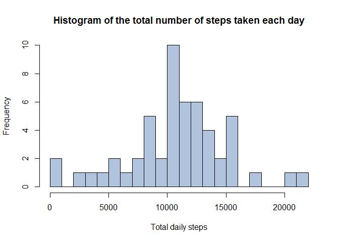
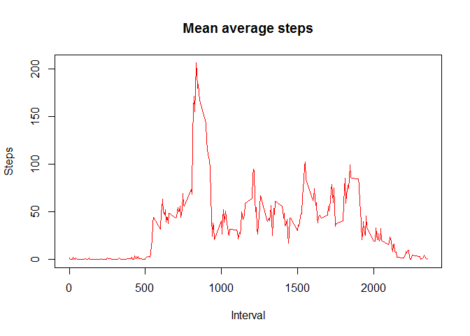
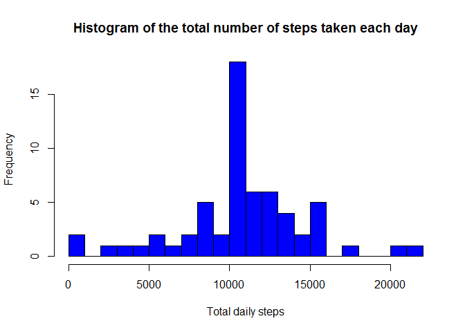
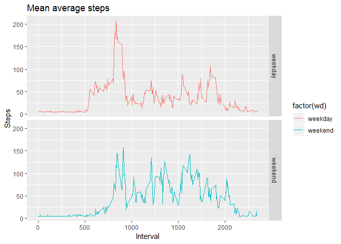

## Loading and preprocessing the data

```r
library(ggplot2)
library(scales)
library(Hmisc)

if(!file.exists('activity.csv')){
  unzip('activity.zip')
}

data <- read.csv('activity.csv',header=TRUE)
head(data)
```

```
##   steps       date interval
## 1    NA 2012-10-01        0
## 2    NA 2012-10-01        5
## 3    NA 2012-10-01       10
## 4    NA 2012-10-01       15
## 5    NA 2012-10-01       20
## 6    NA 2012-10-01       25
```

```r
data_wona<-na.omit(data)
```

## What is mean total number of steps taken per day?

```r
steps_total<-aggregate(steps ~ date,data_wona,sum)
hist(steps_total$steps,xlab = "Total daily steps",main="Histogram of the total number of steps taken each day", breaks = 20, col="lightsteelblue")
```

<!-- -->

```r
steps_mean<-mean(steps_total$steps)
print(paste0("mean of the total number of steps taken per day: ", steps_mean))
```

```
## [1] "mean of the total number of steps taken per day: 10766.1886792453"
```

```r
steps_median<-median(steps_total$steps)
print(paste0("median of the total number of steps taken per day: ", steps_median))
```

```
## [1] "median of the total number of steps taken per day: 10765"
```
## What is the average daily activity pattern?

```r
steps_int<-aggregate(steps ~ interval,data_wona,mean)

plot(steps_int$interval,steps_int$steps,type="l",col="red",main = "Mean average steps", xlab = "Interval", ylab = "Steps")
```

<!-- -->

```r
steps_int[steps_int$steps==max(steps_int$steps),]
```

```
##     interval    steps
## 104      835 206.1698
```

## Imputing missing values

```r
sum(is.na(data))
```

```
## [1] 2304
```

```r
data_imp<-data
miss<-is.na(data$steps)
data_imp$steps[miss==TRUE] <- steps_mean / nrow(steps_int)

steps_total_imp<-aggregate(steps ~ date,data_imp,sum)
hist(steps_total_imp$steps,xlab = "Total daily steps",main="Histogram of the total number of steps taken each day", breaks = 20, col="blue")
```

<!-- -->

```r
steps_mean_imp<-mean(steps_total_imp$steps)
print(paste0("mean of the total number of steps taken per day: ", steps_mean_imp))
```

```
## [1] "mean of the total number of steps taken per day: 10766.1886792453"
```

```r
steps_median_imp<-median(steps_total_imp$steps)
print(paste0("median of the total number of steps taken per day: ", steps_median_imp))
```

```
## [1] "median of the total number of steps taken per day: 10766.1886792453"
```

```r
steps_mean == steps_mean_imp
```

```
## [1] TRUE
```

```r
steps_mean > steps_mean_imp
```

```
## [1] FALSE
```

```r
steps_mean < steps_mean_imp
```

```
## [1] FALSE
```

```r
steps_median == steps_median_imp
```

```
## [1] FALSE
```

```r
steps_median > steps_median_imp
```

```
## [1] FALSE
```

```r
steps_median < steps_median_imp
```

```
## [1] TRUE
```

## Are there differences in activity patterns between weekdays and weekends?

```r
data_imp$wd <- ifelse(weekdays(as.Date(data_imp$date)) %in% c("Samstag","Sonntag"), "weekend", "weekday")
head(data_imp)
```

```
##     steps       date interval      wd
## 1 37.3826 2012-10-01        0 weekday
## 2 37.3826 2012-10-01        5 weekday
## 3 37.3826 2012-10-01       10 weekday
## 4 37.3826 2012-10-01       15 weekday
## 5 37.3826 2012-10-01       20 weekday
## 6 37.3826 2012-10-01       25 weekday
```

```r
steps_int_wd <- aggregate(steps ~ interval + wd, data_imp, mean)

ggplot(steps_int_wd, aes(interval, steps,colour=factor(wd))) + 
  geom_line() + 
  facet_grid(wd ~ .) +
 labs(title = "Mean average steps", x = "Interval", y = "Steps")
```

<!-- -->
